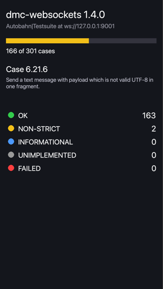
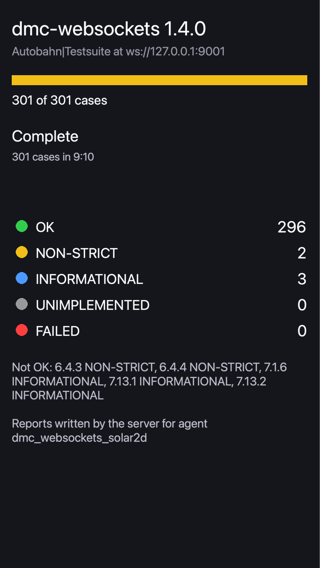

# dmc-websockets

A WebSocket client (RFC 6455) for Solar2D (formerly Corona SDK) apps, written in Lua.

Open a connection, listen for events, and send text or binary messages:

```lua
local WebSockets = require 'dmc_corona.dmc_websockets'

local ws = WebSockets{ uri='wss://echo.websocket.org' }

ws:addEventListener( ws.EVENT, function( event )
	if event.type == ws.ONOPEN then
		ws:send( 'hello' )
	elseif event.type == ws.ONMESSAGE then
		print( 'received:', event.message.data )
	end
end )
```

## Features

- `ws://` and `wss://` (TLS with SNI, so it works with servers on shared hosts and CDNs)
- Text and binary messages, including large ones (tested up to 16MB)
- Fragmented messages, pings and the closing handshake handled for you
- Optional keep-alive pings that detect a dead connection and measure latency
- UTF-8 validation of text messages, as the RFC requires
- Subprotocol negotiation
- Event-based API that fits the Solar2D event loop; no threads or blocking calls
- HTML5 builds too, through the browser's own WebSocket ([try the demo in your browser](https://dmccuskey.github.io/dmc-websockets/), [what differs](docs/api.md#html5-builds))
- Passes the [Autobahn|Testsuite](docs/compliance.md): 296 of 301 cases OK, none failed
- Pure Lua, MIT licensed

The [Autobahn example](examples/dmc-websockets-autobahntestsuite/) runs the whole test suite inside the Solar2D Simulator:




## Quick Start

The following code will get you up and running in about 10 minutes in the Solar2D Simulator on macOS or Windows. It makes an app that connects to a public echo server, sends a message and prints the reply.

Prerequisites: the [Solar2D](https://solar2d.com/) Simulator and a copy of this repository (`git clone https://github.com/dmccuskey/dmc-websockets.git`, or download the ZIP from GitHub).

1. **Copy the library into your project.** From this repository, copy `dmc_corona/`, `dmc_corona_boot.lua` and `dmc_corona.cfg` into your project, at the root level of the project folder.

   **Going further:** keep libraries in a subfolder with [the `LUA_PATH` setting](docs/installation.md#project-layout).

2. **Add the plugins.** Create `build.settings` (or add to yours) with the bit-operations plugin, which makes framing fast, and the OpenSSL plugin, which `wss://` needs:

   ```lua
   settings = {
   	plugins = {
   		["plugin.bit"] = { publisherId = "com.coronalabs" },
   		["plugin.openssl"] = { publisherId = "com.coronalabs" },
   	},
   }
   ```

   **Going further:** Android needs the `INTERNET` permission, see [Installation](docs/installation.md#android).

3. **Connect and echo a message.** Put this in `main.lua`:

   ```lua
   local WebSockets = require 'dmc_corona.dmc_websockets'

   local ws = WebSockets{ uri='wss://echo.websocket.org' }

   ws:addEventListener( ws.EVENT, function( event )
   	if event.type == ws.ONOPEN then
   		print( 'connected' )
   		ws:send( 'hello from Solar2D' )

   	elseif event.type == ws.ONMESSAGE then
   		print( 'received:', event.message.data )

   	elseif event.type == ws.ONCLOSE or event.type == ws.ONERROR then
   		print( 'closed:', event.code, event.reason )
   	end
   end )
   ```

4. **Run it** in the Simulator. The console shows:

   ```text
   connected
   received:	Request served by 1a2b3c4d5e6f
   received:	hello from Solar2D
   ```

   The first message is a greeting this particular server sends; the second is your echo. If `connected` never appears, the console shows the reason; for a `wss://` address, check that `plugin.openssl` is in `build.settings`.

   **Going further:** send binary data, choose subprotocols and handle errors with the [API reference](docs/api.md).

**Updating:** copy the same files again from a newer version of this repository. The [changelog](CHANGELOG.md) lists what changed.

## Documentation

- [Installation](docs/installation.md): project layout, plugins, Android
- [API reference](docs/api.md): options, methods, events and constants
- [Protocol compliance](docs/compliance.md): Autobahn|Testsuite results
- [Examples](examples/README.md): an echo client, an echo demo with a screen which also runs in the browser, the Autobahn test client, and a Pusher client
- [Development](docs/development.md): tests, rebuilding the bundled libraries, ideas

Everything else is on the [documentation home](docs/README.md).

## Acknowledgements

The framing and handshake code was adapted from [lua-resty-websocket](https://github.com/openresty/lua-resty-websocket), [lua-websockets](https://github.com/lipp/lua-websockets) and [Lumen](https://github.com/xopxe/Lumen). Thanks to their authors.

HTML5 support and pong handling contributed by Christian Kündig ([@chkuendig](https://github.com/chkuendig)).

## License

MIT, see [LICENSE](LICENSE). The bundled DMC libraries in `dmc_corona/` are MIT licensed too. `dmc_corona/lib/sha1.lua` is Jeffrey Friedl's pure-Lua SHA-1 (version 1, 2009); its header states his copyright but no license.
