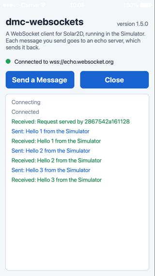
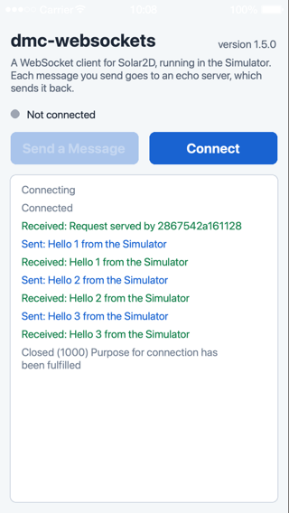

# Example: An Echo Demo for the Browser

A small app with a screen: it connects to the public echo server at `wss://echo.websocket.org`, sends a message each time you press **Send a Message**, and lists what was sent and what came back. **Close** ends the connection and **Connect** opens a new one.

**[Try it in your browser](https://dmccuskey.github.io/dmc-websockets/)**: that page is this example as an HTML5 build.

<p>


</p>

The same `main.lua` runs in the Solar2D Simulator, on a device and in the browser. In the Simulator and on a device the library uses sockets; in the browser it uses the browser's own WebSocket ([what differs](../../docs/api.md#html5-builds)). The app's second line of text says where it is running.

## Run It in the Simulator

Open this folder in the Solar2D Simulator (File > Open, choose `main.lua`). It connects right away. The server greets each connection with a `Request served by` message before it echoes.

## Build It for the Browser

1. In the Simulator, with the example open, choose File > Build > HTML5, and pick a folder for the result.
2. The build is a folder of static files. Browsers don't run it from a `file://` address, so serve it from a web server. For a look on your own computer, from inside that folder:

   ```sh
   python3 -m http.server 8000
   ```

   and open `http://localhost:8000/`.

Two things to know:

- **`dmc_corona/` must be at the root of the project**, as it is here: Solar2D finds the library's JavaScript file by its full `require` name.
- **The app only runs while its page has the focus.** Solar2D suspends an HTML5 app when the browser window loses focus (you click another window, or the browser's developer tools), and a browser stops drawing a tab it can't see. A suspended app runs no frames and no timers, so nothing on screen moves and a close stays at "Closing". The connection itself stays open, and the messages which arrive meanwhile are delivered when you click the page again.

A page served over `https://` can only open `wss://` connections.

## What to Expect

- The server sometimes closes a connection by itself (for instance code 1012, `restarting`): press **Connect** for a new one.
- In the browser, **Close** takes about two seconds and the close has no reason text. In the Simulator the log also shows the library's reason.
